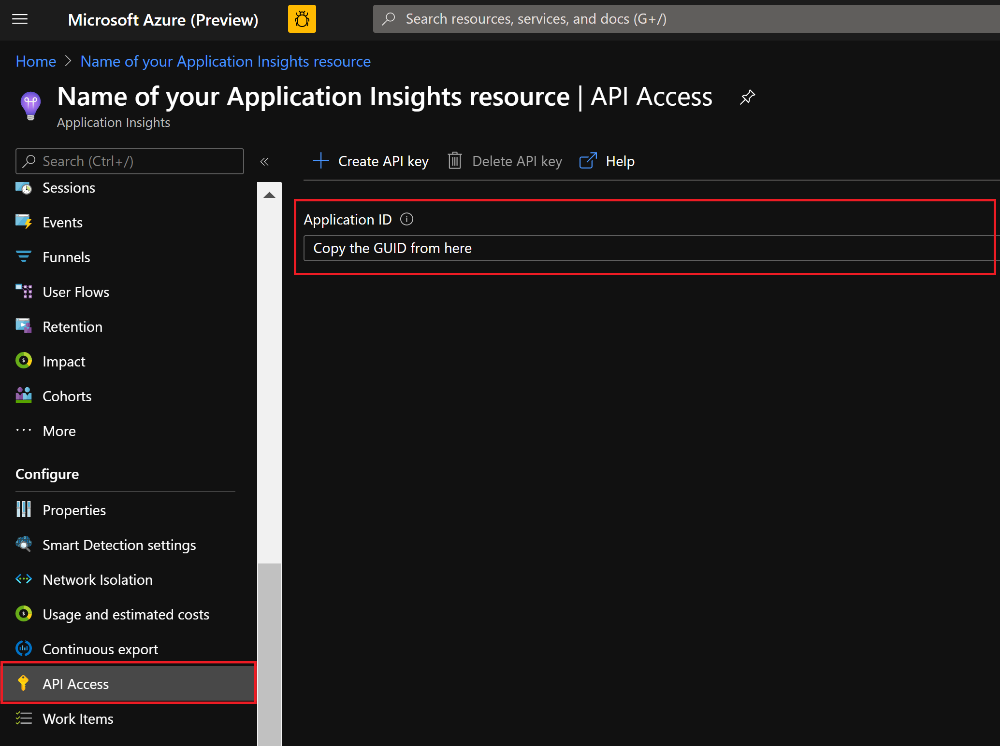
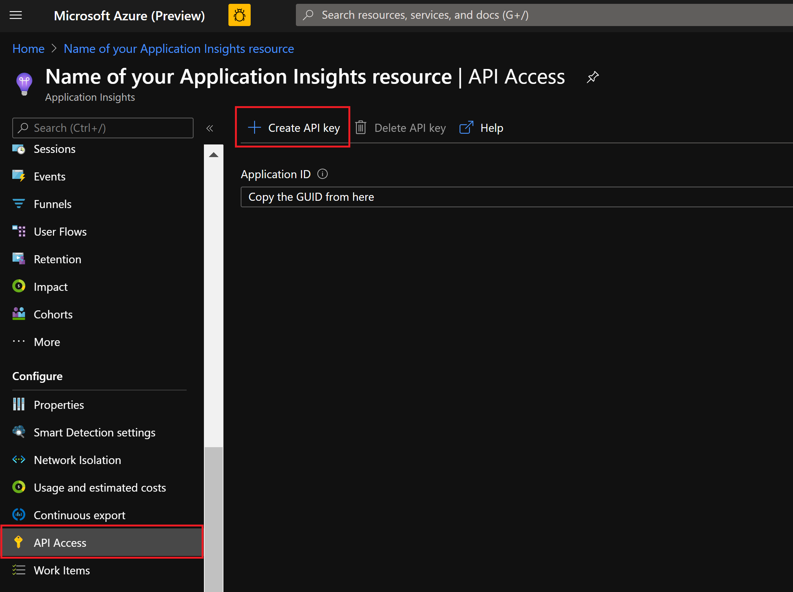
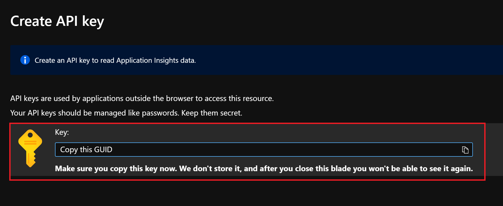

Telemetry in Azure Application Insights is a very powerful tool to investigate issues after they have occured (where you cannot attach a debugger to troubleshoot the issue). Having a good arsenal of Kusto query language (KQL) scripts can be very handy, but sometimes executing KQL statements one by one in the Azure Application Insights portal can be tedious. This is where notebooks come in handy, and in this part of the samples repository we show you how to get started using Jupyter notebooks in Azure Data Studio. With the Kqlmagic module, you can now combine KQL with Python to create powerful interactive trouble shooting guides (TSGs).

# Sample Trouble Shooting Guides (TSGs)
Currently, this repository contains TSGs for 
* Investigating performance issues (overview analysis)
* Investigating login issues 
* Investigating if environments are using deprecated web service protocols

# What is Azure Data Studio?
Azure Data Studio is a cross-platform database tool for data professionals using the Microsoft family of on-premises and cloud data platforms on Windows, MacOS, and Linux. Azure Data Studio offers a modern editor experience with IntelliSense, code snippets, source control integration, and an integrated terminal. It's engineered with the data platform user in mind, with built-in charting of query result sets and customizable dashboards. 

# What is Kqlmagic?
Kqlmagic is a command that extends the capabilities of the Python kernel in Azure Data Studio notebooks. You can combine Python and Kusto query language (KQL) to query and visualize data using rich Plot.ly library integrated with render commands. Kqlmagic brings you the benefit of notebooks, data analysis, and rich Python capabilities all in the same location. Supported data sources with Kqlmagic include Azure Data Explorer, Application Insights, and Azure Monitor logs.

# Get up and running (install and configure Azure Data Studio)
1. First, you need to download and install Azure Data Studio. See how to here: https://docs.microsoft.com/en-us/sql/azure-data-studio/download-azure-data-studio
2. Now create a new notebook (needed for steps 3+4 below) and choose the Python3 kernel, see https://docs.microsoft.com/en-us/sql/azure-data-studio/notebooks-tutorial-python-kernel#create-a-notebook
3. Install a Python kernel for Azure Data Studio (let Azure Data Studio do it for you or reuse an existing Python installation). See how to here: https://docs.microsoft.com/en-us/sql/azure-data-studio/notebooks-tutorial-python-kernel#change-the-python-kernel

# Install and set up Kqlmagic
To install and set up Kqlmagic, open a python notebook. Click the "Manage Packages" icon on the right of the notebook:

Under the "Add new" tab, type "kqlmagic" and click Install:

# How to connect Kqlmagic to an Azure Application Insights resource
You need two GUIDs to be able to read data from your Application Insights resource: 
1. Application ID
2. an API key

Get the Application ID from the *API Access* page in the Application Insights portal:

Then generate an API key 

You can now use the Application ID and API key to connect to and read from the Application Insights resource from the notebook. 

See more here: https://docs.microsoft.com/en-us/sql/azure-data-studio/notebooks-kqlmagic#kqlmagic-with-application-insights

